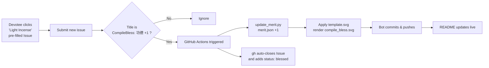

# 🕯️ CompileBless · Cyber Incense for Merit

<p align="center">
  <a href="README.md">繁體中文</a> ·
  <b>English</b> ·
  <a href="README.ja.md">日本語</a> ·
  <a href="README.ko.md">한국어</a>
</p>

> An interactive README component that runs **entirely inside GitHub — no backend server required**.
> A devotee (engineer) clicks a link in the README, submits an Issue, and GitHub Actions automatically lights the incense, accumulates merit, updates the artwork, and lets the "deity" close the Issue for you. May all your builds stay green and your pipelines forever blue.

<p align="center">
  
</p>

<p align="center">
  <a href="https://github.com/MikeYC-Wang/CompileBless/issues/new?title=CompileBless%3A%20%E5%8A%9F%E5%BE%B7%20%2B1&body=%E6%84%9F%E8%AC%9D%E9%96%8B%E6%BA%90%EF%BC%8C%E9%A1%98%E6%88%91%20build%20%E5%B8%B8%E7%B6%A0%E3%80%82%0A%0A%EF%BC%88%E7%9B%B4%E6%8E%A5%E9%BB%9E%E4%B8%8B%E6%96%B9%20Submit%20new%20issue%20%E5%8D%B3%E5%8F%AF%EF%BC%8C%E5%85%B6%E9%A4%98%E4%BA%A4%E7%B5%A6%E7%A5%9E%E6%98%8E%E3%80%82%EF%BC%89">
    <b>👉 Light Incense & Gain Merit 👈</b>
  </a>
</p>

---

## ⚙️ How It Works



| File | Purpose |
| --- | --- |
| [`.github/workflows/compile_bless.yml`](.github/workflows/compile_bless.yml) | Issue-triggered automation workflow |
| [`scripts/update_merit.py`](scripts/update_merit.py) | Core script that reads/writes merit and renders the SVG |
| [`data/merit.json`](data/merit.json) | Merit counter database |
| [`assets/base.png`](assets/base.png) | Voxel censer / CODE MERIT box base image (base64-embedded into the SVG) |
| [`assets/template.svg`](assets/template.svg) | Hybrid template: embedded base image + incense/smoke/floating-text/board animation overlays |
| `compile_bless.svg` | The generated artwork shown in the README (self-contained, single file) |

---

## 🔗 The "One-Click Issue Trigger" URL

GitHub's New Issue page supports **pre-filling the form via query string**. Basic format:

```
https://github.com/<owner>/<repo>/issues/new?title=<title>&body=<body>
```

The actual link for this project (owner = `MikeYC-Wang`, repo = `CompileBless`):

```
https://github.com/MikeYC-Wang/CompileBless/issues/new?title=CompileBless%3A%20%E5%8A%9F%E5%BE%B7%20%2B1&body=%E6%84%9F%E8%AC%9D%E9%96%8B%E6%BA%90%EF%BC%8C%E9%A1%98%E6%88%91%20build%20%E5%B8%B8%E7%B6%A0%E3%80%82
```

### Parameters

| Param | Meaning | Notes |
| --- | --- | --- |
| `title` | Issue title | **Must** start with `CompileBless: 功德 +1` for the workflow to run |
| `body` | Issue body | Optional — write your own prayer |
| `labels` | Pre-applied labels | Optional, e.g. `labels=bless` |
| `template` | Issue template | Optional |

> ⚠️ The trigger title **must** keep the Chinese prefix `CompileBless: 功德 +1` (URL-encoded as `CompileBless%3A%20%E5%8A%9F%E5%BE%B7%20%2B1`), because the workflow matches on that exact string.

### URL Encoding Cheatsheet

Parameter values must be **URL-encoded**. Common mappings:

| Character | Encoded |
| --- | --- |
| space | `%20` |
| `:` | `%3A` |
| `+` | `%2B` |
| `，` (fullwidth comma) | `%EF%BC%8C` |
| newline | `%0A` |
| `功德` | `%E5%8A%9F%E5%BE%B7` |

> 💡 Building the string by hand is error-prone; generate it with a tool:
> - JavaScript: `encodeURIComponent("CompileBless: 功德 +1")`
> - Python: `urllib.parse.quote("CompileBless: 功德 +1")`

So the `title` `CompileBless: 功德 +1` encodes to:

```
CompileBless%3A%20%E5%8A%9F%E5%BE%B7%20%2B1
```

### Two Ways to Embed in a README

Markdown link:

```markdown
[👉 Light Incense & Gain Merit 👈](https://github.com/MikeYC-Wang/CompileBless/issues/new?title=CompileBless%3A%20%E5%8A%9F%E5%BE%B7%20%2B1&body=Thanks%20for%20open%20source)
```

Centered HTML button:

```html
<p align="center">
  <a href="https://github.com/MikeYC-Wang/CompileBless/issues/new?title=CompileBless%3A%20%E5%8A%9F%E5%BE%B7%20%2B1">
    <b>👉 Light Incense & Gain Merit 👈</b>
  </a>
</p>
```

---

## 🚀 Install Into Your Own Project

1. Copy the `.github/`, `scripts/`, `data/`, and `assets/` folders into your repo (`assets/base.png` is the base image — swap in your own voxel art if you like).
2. Run `python scripts/update_merit.py` once to generate the initial `compile_bless.svg` (or reuse this project's).
3. Under `Settings → Actions → General → Workflow permissions`, choose **Read and write permissions**.
4. Paste the trigger link and `` into your README, replacing `MikeYC-Wang/CompileBless` with your own `<owner>/<repo>`.
5. Done! From now on every Issue matching the title rule automatically lights the incense, closes, and gets the `status: blessed` label.

> 📌 **To display it in a different repo (e.g. your profile README)**, you can't use a relative path, and you should **avoid `raw.githubusercontent.com` (large files easily hit 429 Too Many Requests)**. Use the jsDelivr CDN instead:
> ```markdown
> 
> ```
> This project's workflow automatically calls `purge.jsdelivr.net` after each +1 to clear the CDN cache so the counter updates promptly.

---

## 🎨 Animation Details

- **Base image**: `assets/base.png` (voxel censer + CODE MERIT box) is read by the script and embedded as a `data:` URI, so the output is a single self-contained file that displays and animates even when loaded via `` on GitHub.
- **Incense smoke**: 3 incense sticks (dark red + charred tips + flickering embers) sit in the censer; the smoke rises slowly and sways left/right via SVG groups + CSS `@keyframes`, fading from opacity 1 to 0 with height.
- **Floating merit text**: green `+1 Merit` and `-1 Bug` alternately float up and fade out (offset via `animation-delay`).
- **Ember flicker**: the orange embers at the incense tips pulse via the `ember` animation.
- **Counter board**: a pixel-font panel shows "Global engineers' accumulated merit today: {merit_count}".

> ⚠️ GitHub proxies and caches images through camo, so updates may take tens of seconds to appear; the animations (CSS/SMIL) still play in an SVG embedded via ``.

---

## 📜 License

Licensed under the [MIT License](LICENSE). Fork it, light the incense, join in. May your `git push` be all green.
