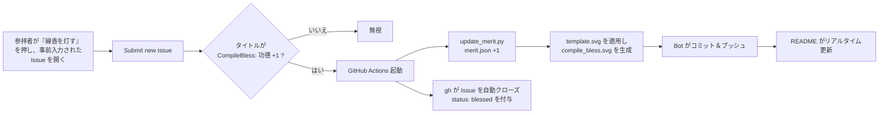

# 🕯️ CompileBless · サイバー線香で功徳を積む

<p align="center">
  <a href="README.md">繁體中文</a> ·
  <a href="README.en.md">English</a> ·
  <b>日本語</b> ·
  <a href="README.ko.md">한국어</a>
</p>

> **バックエンドサーバー不要、すべて GitHub 内で完結する** インタラクティブな README コンポーネント。
> 参拝者（エンジニア）が README のリンクをクリックして Issue を送信すると、GitHub Actions が自動で線香に火を灯し、功徳を積み、画像を更新し、「神様」が Issue を閉じてくれます。あなたのビルドが常に緑で、パイプラインが永遠に青くありますように。

<p align="center">
  
</p>

<p align="center">
  <a href="https://github.com/MikeYC-Wang/CompileBless/issues/new?title=CompileBless%3A%20%E5%8A%9F%E5%BE%B7%20%2B1&body=%E6%84%9F%E8%AC%9D%E9%96%8B%E6%BA%90%EF%BC%8C%E9%A1%98%E6%88%91%20build%20%E5%B8%B8%E7%B6%A0%E3%80%82%0A%0A%EF%BC%88%E7%9B%B4%E6%8E%A5%E9%BB%9E%E4%B8%8B%E6%96%B9%20Submit%20new%20issue%20%E5%8D%B3%E5%8F%AF%EF%BC%8C%E5%85%B6%E9%A4%98%E4%BA%A4%E7%B5%A6%E7%A5%9E%E6%98%8E%E3%80%82%EF%BC%89">
    <b>👉 線香を灯して功徳を積む 👈</b>
  </a>
</p>

---

## ⚙️ 仕組み



| ファイル | 用途 |
| --- | --- |
| [`.github/workflows/compile_bless.yml`](.github/workflows/compile_bless.yml) | Issue トリガーの自動化ワークフロー |
| [`scripts/update_merit.py`](scripts/update_merit.py) | 功徳の読み書きと SVG 生成を行うコアスクリプト |
| [`data/merit.json`](data/merit.json) | 功徳カウンターのデータベース |
| [`assets/base.png`](assets/base.png) | ボクセル香炉 / CODE MERIT 箱のベース画像（base64 で SVG に埋め込み） |
| [`assets/template.svg`](assets/template.svg) | ハイブリッドテンプレート：ベース画像の埋め込み + 線香/煙/浮遊テキスト/看板アニメの重ね合わせ |
| `compile_bless.svg` | スクリプトが自動生成し README に表示する成果物（画像内蔵・単一ファイル） |

---

## 🔗 「ワンクリック Issue トリガー」URL

GitHub の New Issue ページは **クエリ文字列でフォームの事前入力** に対応しています。基本形式：

```
https://github.com/<owner>/<repo>/issues/new?title=<タイトル>&body=<本文>
```

本プロジェクトの実際のリンク（owner = `MikeYC-Wang`、repo = `CompileBless`）：

```
https://github.com/MikeYC-Wang/CompileBless/issues/new?title=CompileBless%3A%20%E5%8A%9F%E5%BE%B7%20%2B1&body=%E6%84%9F%E8%AC%9D%E9%96%8B%E6%BA%90%EF%BC%8C%E9%A1%98%E6%88%91%20build%20%E5%B8%B8%E7%B6%A0%E3%80%82
```

### パラメータ

| パラメータ | 意味 | 備考 |
| --- | --- | --- |
| `title` | Issue タイトル | ワークフローが動くには **必ず** `CompileBless: 功德 +1` で始めること |
| `body` | Issue 本文 | 任意 — 自由に祈願文を書けます |
| `labels` | 事前付与ラベル | 任意、例：`labels=bless` |
| `template` | Issue テンプレート | 任意 |

> ⚠️ トリガーのタイトルは **必ず** 中国語の接頭辞 `CompileBless: 功德 +1`（URL エンコードで `CompileBless%3A%20%E5%8A%9F%E5%BE%B7%20%2B1`）を保ってください。ワークフローはこの完全一致で判定します。

### URL エンコード早見表

パラメータ値は **URL エンコード** が必要です。よくある対応：

| 文字 | エンコード後 |
| --- | --- |
| スペース | `%20` |
| `:` | `%3A` |
| `+` | `%2B` |
| `，`（全角カンマ） | `%EF%BC%8C` |
| 改行 | `%0A` |
| `功德` | `%E5%8A%9F%E5%BE%B7` |

> 💡 手作業は間違えやすいので、ツールで生成しましょう：
> - JavaScript：`encodeURIComponent("CompileBless: 功德 +1")`
> - Python：`urllib.parse.quote("CompileBless: 功德 +1")`

したがって `title` の `CompileBless: 功德 +1` は次のようにエンコードされます：

```
CompileBless%3A%20%E5%8A%9F%E5%BE%B7%20%2B1
```

### README への埋め込み方（2 通り）

Markdown リンク：

```markdown
[👉 線香を灯して功徳を積む 👈](https://github.com/MikeYC-Wang/CompileBless/issues/new?title=CompileBless%3A%20%E5%8A%9F%E5%BE%B7%20%2B1&body=Thanks)
```

中央寄せの HTML ボタン：

```html
<p align="center">
  <a href="https://github.com/MikeYC-Wang/CompileBless/issues/new?title=CompileBless%3A%20%E5%8A%9F%E5%BE%B7%20%2B1">
    <b>👉 線香を灯して功徳を積む 👈</b>
  </a>
</p>
```

---

## 🚀 自分のプロジェクトへ導入

1. `.github/`、`scripts/`、`data/`、`assets/` の 4 フォルダを自分のリポジトリにコピー（`assets/base.png` はベース画像 — 好みのボクセルアートに差し替え可）。
2. `python scripts/update_merit.py` を一度実行し、初期の `compile_bless.svg` を生成（本プロジェクトのものを流用しても可）。
3. `Settings → Actions → General → Workflow permissions` で **Read and write permissions** を選択。
4. トリガーリンクと `` を README に貼り、`MikeYC-Wang/CompileBless` を自分の `<owner>/<repo>` に置換。
5. 完了！以降、タイトル規則に合致する Issue は自動で線香に火が灯り、クローズされ、`status: blessed` ラベルが付きます。

> 📌 **別のリポジトリ（例：プロフィール README）で表示する場合**、相対パスは使えません。また **`raw.githubusercontent.com` は避けてください（大きいファイルは 429 Too Many Requests になりやすい）**。代わりに jsDelivr CDN を使いましょう：
> ```markdown
> 
> ```
> 本プロジェクトのワークフローは +1 のたびに `purge.jsdelivr.net` を呼んで CDN キャッシュを消し、カウンターが速やかに更新されるようにしています。

---

## 🎨 アニメーションの詳細

- **ベース画像**：`assets/base.png`（ボクセル香炉 + CODE MERIT 箱）をスクリプトが読み込み `data:` URI として埋め込むため、成果物は単一の自己完結ファイルとなり、GitHub 上で `` 経由でも表示・アニメーションします。
- **線香の煙**：3 本の線香（暗赤 + 焦げた先端 + 明滅する火種）が香炉に立ち、煙は SVG グループ + CSS `@keyframes` でゆっくり上昇・左右に揺れ、高さに応じて不透明度が 1 から 0 へ変化します。
- **功徳の浮遊テキスト**：緑の `+1 Merit` と `-1 Bug` が交互に空へ昇り消えます（`animation-delay` でずらす）。
- **火種の明滅**：線香の先端のオレンジの火種が `ember` アニメで明滅します。
- **カウンター看板**：ピクセルフォントの看板が「本日の全世界エンジニア累積功徳：{merit_count}」を表示します。

> ⚠️ GitHub は camo で画像をプロキシ・キャッシュするため、更新の反映に数十秒かかることがあります。アニメーション（CSS/SMIL）は `` 埋め込みの SVG でも再生されます。

---

## 📜 ライセンス

オープンソース — Fork して、線香を灯して、一緒に功徳を積みましょう。あなたの `git push` が一面グリーンでありますように。
