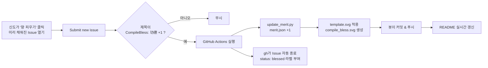

# 🕯️ CompileBless · 사이버 향으로 공덕 쌓기

<p align="center">
  <a href="README.md">繁體中文</a> ·
  <a href="README.en.md">English</a> ·
  <a href="README.ja.md">日本語</a> ·
  <b>한국어</b>
</p>

> **백엔드 서버 없이 GitHub 안에서 완전히 순환하는** 인터랙티브 README 컴포넌트.
> 신도(엔지니어)가 README의 링크를 클릭해 Issue를 제출하면, GitHub Actions가 자동으로 향을 피우고 공덕을 쌓으며 이미지를 갱신하고 "신령님"이 Issue를 닫아 줍니다. 당신의 빌드가 늘 초록빛이고 파이프라인이 영원히 푸르기를.

<p align="center">
  
</p>

<p align="center">
  <a href="https://github.com/MikeYC-Wang/CompileBless/issues/new?title=CompileBless%3A%20%E5%8A%9F%E5%BE%B7%20%2B1&body=%E6%84%9F%E8%AC%9D%E9%96%8B%E6%BA%90%EF%BC%8C%E9%A1%98%E6%88%91%20build%20%E5%B8%B8%E7%B6%A0%E3%80%82%0A%0A%EF%BC%88%E7%9B%B4%E6%8E%A5%E9%BB%9E%E4%B8%8B%E6%96%B9%20Submit%20new%20issue%20%E5%8D%B3%E5%8F%AF%EF%BC%8C%E5%85%B6%E9%A4%98%E4%BA%A4%E7%B5%A6%E7%A5%9E%E6%98%8E%E3%80%82%EF%BC%89">
    <b>👉 향 피우고 공덕 쌓기 👈</b>
  </a>
</p>

---

## ⚙️ 동작 방식



| 파일 | 용도 |
| --- | --- |
| [`.github/workflows/compile_bless.yml`](.github/workflows/compile_bless.yml) | Issue 트리거 자동화 워크플로 |
| [`scripts/update_merit.py`](scripts/update_merit.py) | 공덕 읽기/쓰기 및 SVG 렌더링 핵심 스크립트 |
| [`data/merit.json`](data/merit.json) | 공덕 카운터 데이터베이스 |
| [`assets/base.png`](assets/base.png) | 복셀 향로 / CODE MERIT 함 베이스 이미지(base64로 SVG에 삽입) |
| [`assets/template.svg`](assets/template.svg) | 하이브리드 템플릿: 베이스 이미지 삽입 + 향/연기/떠오르는 텍스트/보드 애니메이션 오버레이 |
| `compile_bless.svg` | 스크립트가 자동 생성해 README에 표시하는 결과물(이미지 내장, 단일 파일) |

---

## 🔗 "원클릭 Issue 트리거" URL

GitHub의 New Issue 페이지는 **쿼리 문자열로 폼 미리 채우기**를 지원합니다. 기본 형식:

```
https://github.com/<owner>/<repo>/issues/new?title=<제목>&body=<본문>
```

이 프로젝트의 실제 링크(owner = `MikeYC-Wang`, repo = `CompileBless`):

```
https://github.com/MikeYC-Wang/CompileBless/issues/new?title=CompileBless%3A%20%E5%8A%9F%E5%BE%B7%20%2B1&body=%E6%84%9F%E8%AC%9D%E9%96%8B%E6%BA%90%EF%BC%8C%E9%A1%98%E6%88%91%20build%20%E5%B8%B8%E7%B6%A0%E3%80%82
```

### 파라미터

| 파라미터 | 의미 | 비고 |
| --- | --- | --- |
| `title` | Issue 제목 | 워크플로가 실행되려면 **반드시** `CompileBless: 功德 +1`로 시작 |
| `body` | Issue 본문 | 선택 — 원하는 기원문을 자유롭게 작성 |
| `labels` | 미리 부여할 라벨 | 선택, 예: `labels=bless` |
| `template` | Issue 템플릿 | 선택 |

> ⚠️ 트리거 제목은 **반드시** 중국어 접두사 `CompileBless: 功德 +1`(URL 인코딩 시 `CompileBless%3A%20%E5%8A%9F%E5%BE%B7%20%2B1`)를 유지해야 합니다. 워크플로가 이 정확한 문자열로 매칭하기 때문입니다.

### URL 인코딩 치트시트

파라미터 값은 **URL 인코딩**이 필요합니다. 자주 쓰는 대응:

| 문자 | 인코딩 결과 |
| --- | --- |
| 공백 | `%20` |
| `:` | `%3A` |
| `+` | `%2B` |
| `，`(전각 쉼표) | `%EF%BC%8C` |
| 줄바꿈 | `%0A` |
| `功德` | `%E5%8A%9F%E5%BE%B7` |

> 💡 손으로 만들면 실수하기 쉬우니 도구로 생성하세요:
> - JavaScript: `encodeURIComponent("CompileBless: 功德 +1")`
> - Python: `urllib.parse.quote("CompileBless: 功德 +1")`

따라서 `title` `CompileBless: 功德 +1`은 다음과 같이 인코딩됩니다:

```
CompileBless%3A%20%E5%8A%9F%E5%BE%B7%20%2B1
```

### README에 넣는 두 가지 방법

Markdown 링크:

```markdown
[👉 향 피우고 공덕 쌓기 👈](https://github.com/MikeYC-Wang/CompileBless/issues/new?title=CompileBless%3A%20%E5%8A%9F%E5%BE%B7%20%2B1&body=Thanks)
```

가운데 정렬 HTML 버튼:

```html
<p align="center">
  <a href="https://github.com/MikeYC-Wang/CompileBless/issues/new?title=CompileBless%3A%20%E5%8A%9F%E5%BE%B7%20%2B1">
    <b>👉 향 피우고 공덕 쌓기 👈</b>
  </a>
</p>
```

---

## 🚀 내 프로젝트에 설치하기

1. `.github/`, `scripts/`, `data/`, `assets/` 네 폴더를 내 저장소로 복사(`assets/base.png`은 베이스 이미지 — 원하는 복셀 아트로 교체 가능).
2. `python scripts/update_merit.py`를 한 번 실행해 초기 `compile_bless.svg` 생성(이 프로젝트 것을 그대로 써도 됨).
3. `Settings → Actions → General → Workflow permissions`에서 **Read and write permissions** 선택.
4. 트리거 링크와 ``를 README에 붙여넣고 `MikeYC-Wang/CompileBless`를 내 `<owner>/<repo>`로 교체.
5. 완료! 이제 제목 규칙에 맞는 Issue는 자동으로 향이 피워지고 종료되며 `status: blessed` 라벨이 붙습니다.

> 📌 **다른 저장소(예: 프로필 README)에 표시할 때**는 상대 경로를 쓸 수 없고, **`raw.githubusercontent.com`은 피하세요(큰 파일은 429 Too Many Requests가 발생하기 쉬움)**. 대신 jsDelivr CDN을 사용하세요:
> ```markdown
> 
> ```
> 이 프로젝트의 워크플로는 +1 될 때마다 `purge.jsdelivr.net`을 호출해 CDN 캐시를 지워 카운터가 즉시 갱신되도록 합니다.

---

## 🎨 애니메이션 상세

- **베이스 이미지**: `assets/base.png`(복셀 향로 + CODE MERIT 함)를 스크립트가 읽어 `data:` URI로 삽입하므로, 결과물은 단일 자기완결 파일이 되어 GitHub에서 ``로 불러와도 표시·재생됩니다.
- **향 연기**: 3개의 향(짙은 빨강 + 그을린 끝 + 깜빡이는 불씨)이 향로에 꽂혀 있고, 연기는 SVG 그룹 + CSS `@keyframes`로 천천히 올라가며 좌우로 흔들리고 높이에 따라 불투명도가 1에서 0으로 변합니다.
- **공덕 텍스트**: 초록색 `+1 Merit`와 `-1 Bug`가 번갈아 하늘로 떠오르며 사라집니다(`animation-delay`로 엇갈림).
- **불씨 깜빡임**: 향 끝의 주황 불씨가 `ember` 애니메이션으로 깜빡입니다.
- **카운터 보드**: 픽셀 폰트 보드가 "오늘 전 세계 엔지니어 누적 공덕: {merit_count}"를 표시합니다.

> ⚠️ GitHub는 camo로 이미지를 프록시·캐시하므로 갱신 반영에 수십 초가 걸릴 수 있습니다. 애니메이션(CSS/SMIL)은 ``로 삽입된 SVG에서도 재생됩니다.

---

## 📜 라이선스

이 프로젝트는 [MIT License](LICENSE)로 배포됩니다. Fork 하고, 향을 피우고, 함께 공덕을 쌓아요. 당신의 `git push`가 온통 초록빛이기를.
