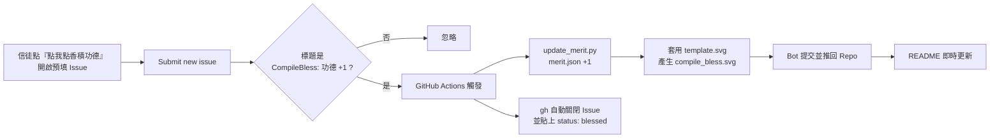

# 🕯️ CompileBless · 賽博點香積功德

<p align="center">
  <b>繁體中文</b> ·
  <a href="README.en.md">English</a> ·
  <a href="README.ja.md">日本語</a> ·
  <a href="README.ko.md">한국어</a>
</p>

> 一個 **免後端主機、完全在 GitHub 內循環** 的互動式 README 組件。
> 信徒（工程師）在 README 點一下連結、送出一個 Issue，GitHub Actions 就會自動幫你點香、累積功德、更新畫面、並由「神明」自動關閉 Issue。願天下 build 常綠、pipeline 常青。

<p align="center">
  
</p>

<p align="center">
  <a href="https://github.com/MikeYC-Wang/CompileBless/issues/new?title=CompileBless%3A%20%E5%8A%9F%E5%BE%B7%20%2B1&body=%E6%84%9F%E8%AC%9D%E9%96%8B%E6%BA%90%EF%BC%8C%E9%A1%98%E6%88%91%20build%20%E5%B8%B8%E7%B6%A0%E3%80%82%0A%0A%EF%BC%88%E7%9B%B4%E6%8E%A5%E9%BB%9E%E4%B8%8B%E6%96%B9%20Submit%20new%20issue%20%E5%8D%B3%E5%8F%AF%EF%BC%8C%E5%85%B6%E9%A4%98%E4%BA%A4%E7%B5%A6%E7%A5%9E%E6%98%8E%E3%80%82%EF%BC%89">
    <b>👉 點我點香積功德 👈</b>
  </a>
</p>

---

## ⚙️ 系統如何運作



| 檔案 | 用途 |
| --- | --- |
| [`.github/workflows/compile_bless.yml`](.github/workflows/compile_bless.yml) | Issue 觸發的自動化工作流 |
| [`scripts/update_merit.py`](scripts/update_merit.py) | 讀寫功德、渲染 SVG 的核心腳本 |
| [`data/merit.json`](data/merit.json) | 功德累積數據庫 |
| [`assets/base.png`](assets/base.png) | 體素香爐 / CODE MERIT 箱底圖（會被 base64 內嵌進 SVG） |
| [`assets/template.svg`](assets/template.svg) | 混合模板：內嵌底圖 + 疊加線香/煙霧/飄字/看板動畫 |
| `compile_bless.svg` | 由腳本自動產生、給 README 顯示的成品（自帶底圖，單檔可用） |

---

## 🔗 「一鍵觸發 Issue」超連結語法

GitHub 的 New Issue 頁面支援用 **Query String 參數預填**表單。基本格式：

```
https://github.com/<擁有者>/<專案>/issues/new?title=<標題>&body=<內文>
```

本專案的實際連結（擁有者＝`MikeYC-Wang`，專案＝`CompileBless`）：

```
https://github.com/MikeYC-Wang/CompileBless/issues/new?title=CompileBless%3A%20%E5%8A%9F%E5%BE%B7%20%2B1&body=%E6%84%9F%E8%AC%9D%E9%96%8B%E6%BA%90%EF%BC%8C%E9%A1%98%E6%88%91%20build%20%E5%B8%B8%E7%B6%A0%E3%80%82
```

### 參數說明

| 參數 | 意義 | 注意事項 |
| --- | --- | --- |
| `title` | Issue 標題 | **必須**以 `CompileBless: 功德 +1` 開頭，工作流才會辦理 |
| `body` | Issue 內文 | 可自由填寫祈願文，選填 |
| `labels` | 預掛標籤 | 選填，例如 `labels=bless` |
| `template` | Issue 模板 | 選填 |

### URL 編碼對照（重點）

參數值必須做 **URL Encoding**，常見對照：

| 原字元 | 編碼後 |
| --- | --- |
| 空格 | `%20` |
| `:` | `%3A` |
| `+` | `%2B` |
| `，`（全形逗號） | `%EF%BC%8C` |
| 換行 | `%0A` |
| `功德` | `%E5%8A%9F%E5%BE%B7` |

> 💡 手動組字串容易出錯，建議用工具產生：
> - JavaScript：`encodeURIComponent("CompileBless: 功德 +1")`
> - Python：`urllib.parse.quote("CompileBless: 功德 +1")`

因此 `title` 的 `CompileBless: 功德 +1` 編碼後即為：

```
CompileBless%3A%20%E5%8A%9F%E5%BE%B7%20%2B1
```

### 放進 README 的兩種寫法

Markdown 連結：

```markdown
[👉 點我點香積功德 👈](https://github.com/MikeYC-Wang/CompileBless/issues/new?title=CompileBless%3A%20%E5%8A%9F%E5%BE%B7%20%2B1&body=%E6%84%9F%E8%AC%9D%E9%96%8B%E6%BA%90)
```

HTML 置中按鈕：

```html
<p align="center">
  <a href="https://github.com/MikeYC-Wang/CompileBless/issues/new?title=CompileBless%3A%20%E5%8A%9F%E5%BE%B7%20%2B1">
    <b>👉 點我點香積功德 👈</b>
  </a>
</p>
```

---

## 🚀 安裝到你自己的專案

1. 複製 `.github/`、`scripts/`、`data/`、`assets/` 四個資料夾到你的 Repo（`assets/base.png` 是底圖，可換成你自己的體素圖）。
2. 執行一次 `python scripts/update_merit.py` 產生初始 `compile_bless.svg`（或直接沿用本專案的）。
3. 在 `Settings → Actions → General → Workflow permissions` 選擇 **Read and write permissions**。
4. 把上面的超連結與 `` 貼進你的 README，並把 `MikeYC-Wang/CompileBless` 換成你自己的 `<擁有者>/<專案>`。
5. 完成！之後每個符合標題規則的 Issue 都會自動點香、關閉並蓋上 `status: blessed`。

> 📌 **要在「別的 repo」（例如個人 profile README）顯示時**，不能用相對路徑，也**別用 `raw.githubusercontent.com`（大檔易觸發 429 Too Many Requests）**。請改用 jsDelivr CDN：
> ```markdown
> 
> ```
> 本專案的工作流會在每次 +1 後自動呼叫 `purge.jsdelivr.net` 清除 CDN 快取，讓計數即時更新。

---

## 🎨 動態特效說明

- **底圖**：`assets/base.png`（體素香爐 + CODE MERIT 箱）由腳本讀取後轉成 `data:` URI 內嵌進 SVG，成品單檔即含圖，GitHub 用 `` 載入也能顯示並播放動畫。
- **線香煙霧**：3 根線香（暗紅 + 焦黑頂 + 火星閃爍）插在爐口，煙以 SVG 群組 + CSS `@keyframes` 緩慢上升、左右擺動，透明度隨高度由 1 漸變為 0。
- **功德飄字**：綠色 `+1 Merit` 與 `-1 Bug` 交替往天空飄升淡出（`animation-delay` 錯開）。
- **火星閃爍**：線香頂端橘色火星以 `ember` 動畫忽明忽暗。
- **計數看板**：像素字體顯示「今日全球工程師已累積功德：{merit_count}」。

> ⚠️ GitHub 會透過 camo 代理快取圖片，畫面更新後有時需數十秒才會反映；動畫（CSS/SMIL）在以 `` 內嵌的 SVG 中仍可正常播放。

---

## 📜 授權

開源專案，歡迎 Fork、點香、共襄盛舉。願您 `git push` 一路綠燈。
